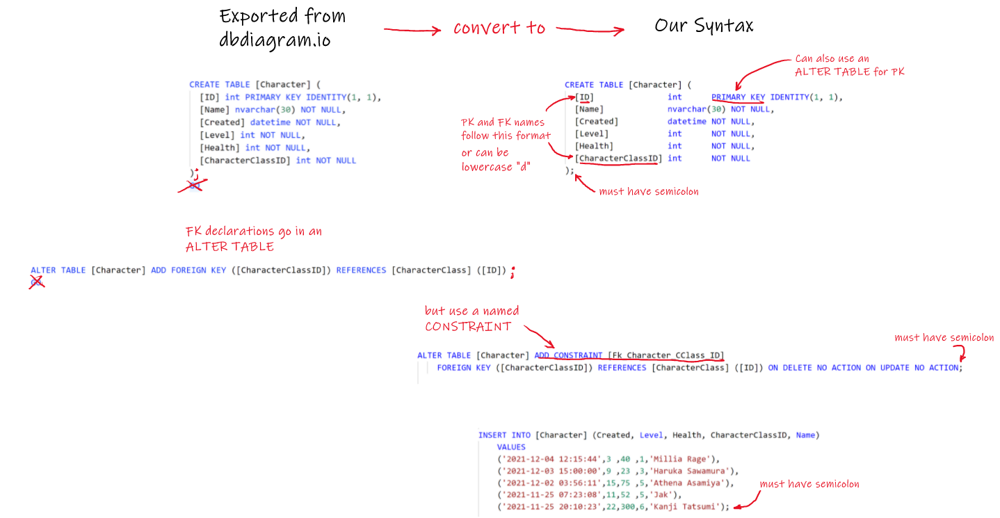

## Architectural Decisions
	
1. What folder structure and naming convention will you use for your project source code? You'll have at least 4 projects: 1) the main project, 2) NUnit testing project, 3) BDD testing project, and 4) Jest javascript testing project. Your test projects should all begin or end in the word Tests_ or _Tests.
    * Main Project Name: Voting_App.sln
    * NUnit Testing Project Name: Tests_NUnit_Voting_App
    * BDD Testing Project Name: Tests_BDD_Voting_App
    * Jest JavaScript Testing Project Name: Tests_JS_Voting_App
 
2. What .NET Core version to use?
	* .NET Core 6.0
 
3. What front-end CSS library and version are you going to use? I recommend the latest version of Bootstrap, but we have had teams use other libraries. Last year a team went with a really nice minimalist design and used UIkit. I've used Materialize for it's smaller and simpler approach. You may also want to talk about whether or not theme-ing is important for your project.
    * Latest version of Bootstrap
 
4. Decide on how you'll use Javascript: jQuery (which version) or go for plain old JS. Any other libraries you think you'll want to use? Regardless of your decision, all team members must follow the same convention -- no mix and match.
    * jQuery 3.6.0
 
5. How will you name your Git branches? Choose a strategy. Unfortunately it looks like the “Create Branch” feature in Jira is only available for Bitbucket repositories or GitHub repos with an Enterprise Account.
    * Features: f_va#_branch_name
    * Bugs: b_va#_branch_name   
 
6. How will you write your database scripts, table names, PK and FK names? Because of some tools I'll give you later, I'm making this decision for you. See the example I'll put in the module. It'll be required that everyone follow this example to the letter!

7. Will you use eager loading or enable lazy loading of related entities in Entity Framework Core? I rather regret not teaching and using lazy loading during CS 460 -- eager loading caused so many difficulties for people! There are some issues to be aware of when using lazy loading, which we'll talk about during class this term but nothing to be hesitant about.
	* Lazy loading