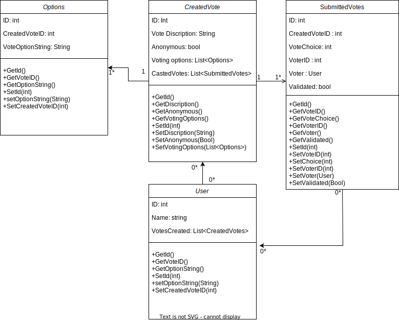

# Requirements Workup

# Feature 2: Cast a vote
## Elicitation
* Yes, we think the goal is well defined, we understand that the goal is to make a selection from the options on a created vote and have them stored in the database. 
* Does the user casting a vote need an account? 
* In the case of a round robin vote how does a user submit multiple votes?
* How do we prevent someone from voting multiple times?
* Can the person creating the vote also cast a vote, if so, how?
* The scope is clear for this feature, we understand that it contains only items relating to the casting of a vote and verification of a given vote. 
* How are submitted votes being stored in a way that they can be related to the created vote?

## Analysis
  
* If not specified by the vote creator a user will not need an account to cast a vote but may still need to verify themselves by other means. 
* Round robin votes will be time constrained in such a way that if the user doesn't submit a vote in time, it will move on with the next round of voting. If all votes are cast or the time constraint comes to an end a new room code will be generated with the next round of voting.
* To prevent someone from voting multiple times on a single vote the vote creator can include verification of users when voting via an email code or sms code that has a unique token attached. 
* A person creating a vote will also be allowed to cast a vote and will be held to the same rules as the other voters. 
* Submitted votes will be tied to a created vote via an ID in the database and can be pulled in such a way that when viewing a created vote the submitted votes will be analyzed along with it. 
* From what we can tell at the moment there are no conflicting requirements in this feature. 

## Design and Modeling

 

## Analysis of the Design
* The supports the Casting a Vote feature from waht we can tell for the moment, it allows a vote to be created and be tied to a user account if desired and to be connected to the original vote.
* The created methods also allow for the items of the vote to be edited and set on creation.
* For the given moment we believe that the data model does meet all requirements for the feature, it is the case that changes to the data model will be made as we further along in the development process and we discover more item that are needs to meet these requirements.

