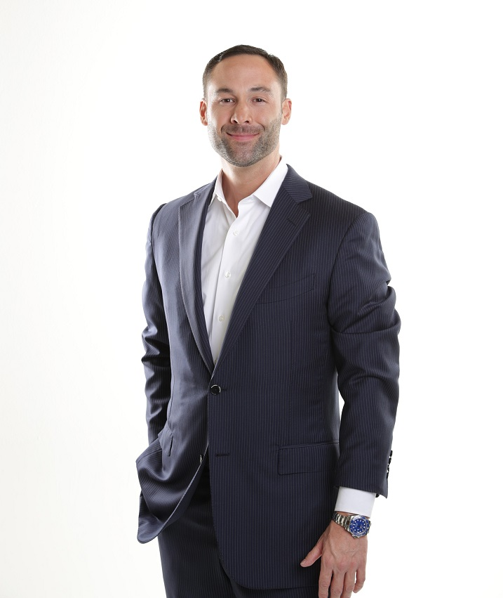
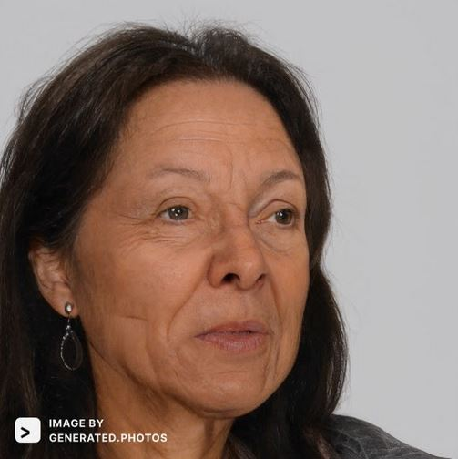

# Stakeholders

## Samuel Torris
Software Engineer
 
## Vincent Nowell
Software Engineer
 
## Kaitlin Haley
Software Engineer
 
## Scot Morse
Advisor / Client
 
## Wanda Trent
Division Chair of CS
 
## Phil Warner
Faculty Senate Secretary
 
## Joe Smith, Cheryl Lee, John Williams, Beatrice Greary
Friends

 

# Personas:

## Lana Connors Persona:
 
Dr.Connors is a 38 year-old professor at the University of Florida in Gainesville where she lives. She has worked for the university for 4 years where she is a professor of advertising. She loves her job.
 
Every year in her advertising 101 class she has students present their advertising products/ideas at the end of the term to the class. This is a way for her students to get feedback on their advertising skills from someone other than herself. Her class then votes on if they believe this was a good idea or not. She has found that oftentimes students all vote together based upon what the people around them are doing. She has tried hand raising which was influenced heavily by peer pressure. She has also tried collecting papers at the end of the class but then finds some students forget to write which presentation they were voting for, their own name, etc. and found it was too difficult and not organized. She wants to be able to have her students vote (and add comments) without seeing the people around them in an organized manner where she can easily look at the results for each different presentation. She also wants to be able to share these results to each student about their presentation where the votes and comments are anonymous.
 
She wants a product that would be simple and easy for her students to use on their phones or laptops so that they are able to vote after each presentation. She would like it if she was able to set up all these votes for each presentation before class starts as well so she doesn't waste student presenters' time.
 

 

## Edward Wilkerson Persona:
 
Edward Wilkerson is a 42 year mid-level manager at Software Applications Specialists in Seattle, WA, where he manages a team of software engineers that work on a retail services management application.
 
Edwards attends many meetings where the managers get together to discuss product roadmaps, project timelines, client engagement and many other topics. When the meeting attendees need to take a vote on a group decision, it is inevitably done by a show of hands. There are many times that Edward has felt awkward about voting this way, since very often those who are leading the meetings have made it pretty obvious which way they would decide, and so Edward feels forced to vote along with them, even if he feels strongly otherwise. He wants to have a way to vote anonymously, so he can give his honest opinion without worrying that his status in the company will be affected.
 
He would like an application that would work on a tablet or smartphone (the two types of devices he most often takes into meetings) that would allow the votes cast in the meetings to be anonymous. The app should be very easy to use, and it would be nice if it would display the results of a vote (after everyone has voted), so that Edward and everyone else in the meeting could see those results.
 
Another feature Edward would like is the ability to have a delayed vote, so that the actual voting time could take place sometime after a meeting. This would give Edward some time to weigh the arguments for and against decisions, which would probably lead to a more thoughtful and meaningful decision on his and everyone else's part.
 

 

## Ruth Garcia:
 
Ruth is a 70 year old retired high school teacher from Washington. Now she lives in Oregon and regularly hosts events with her friends and family.
 
Recently she has been hosting parties at her house, and orders or makes food for the guests that come. She has been trying to change up the types of food she makes, letting the group choose what kinds of food will be made or ordered for the party. Right now she is taking these inputs verbally or via a message but it has caused some problems as some people think that their input is not being considered or is being forgotten as Ruth's memory is not as good as it once was. She has tried having people message their request in but it did not solve the problem of people thinking that she is ignoring their vote. She has also tried verbally asking each person but that did not solve the problem of people forgetting things she was forgetting. As of the last meeting she tried having people raise their hand but she felt that the vote had been swayed by people that were good at convincing people to choose what they wanted. She wants an easy way to hold a vote about what kind of food or where they are going to eat for the next party and get input for each person. She would also like it to be easy to use and not require to make a user account as many of the people voting are not very tech savvy.
 
She also would like to have a few features built into the app as well. Many of the people using the app do not have great vision and she would like some way for them to listen to the options on the
 

