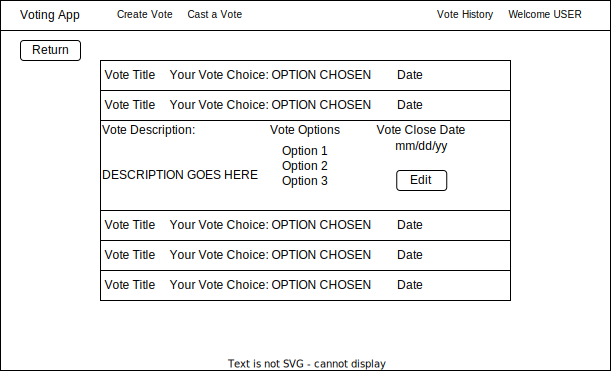

# VA-160

## Title

*As a user, I want to see a list of submitted votes for my account and have the option to edit them if the voting window is still open, so that I can easily see how I voted in the past, and make changes to my submitted vote if I voted incorrectly*

## Description

For this story we want the user to be able to see all of their past votes that they have submitted along with the vote title, desciption and the other voting options. This will allow the user to go back and review their vote after it has been cast so that they can both see how they voted and be able to remember what the vote was that they voted on.

We also want a edit button that is available to the user if the voting window is still open, this will allow the user to go back and change a vote using the exsisting cast a vote pageafter they have submitted it in the case they they made the wrong selection.

We want the list of submitted votes to be available via a navbar item labeled **Vote History** that will take them to the `/Access/VoteHistory` page with the list of votes on it stacked vertically and sorted my date decending. Each item in the list of votes that have been submited by the user should have a drop down item that contains the original vote decription, title, and other options.If the voting window is open there will be an edit button that will take the user to the submit a vote page to resubmit the vote, if the voting window is closed the edit button will be grayed out and not be useable.

### Details:
1. If the user is not logged it, the Vote History button should not appear, if they navigate to the `/Access/VoteHistory` and they are not logged in it should redirect to the loggin page.
2. List of submitted votes will have the vote title, the option chosen, and the date cast.
3. When clicked, the vote will have a drop down that shows the original vote title, decription and the other voting options. 
4. The list should be sorted by date, with the newest vote at the top.
5. The edit button will be active and navigate to the submit a vote page if the voting window is still open.
6. The edit button will be grayed out and not be active if the voting windows has closed.

See mockup below

## Acceptance Criteria
    Given I am on the home page
    And I am logged in
    I will see the Vote History button in the nav bar

    Given I am on the home page
    And I am not logged in
    I will not see the Vote History button in the nav bar

    Given I am on the home page
    And I am logged in
    And I navigate to /Access/VoteHistory
    I will be navigated to the VoteHistory Page

    Given I am on the home page
    And I am not logged in
    And I navigate to /Access/VoteHistory
    I will be navigated to the login page

    Given I am on the Vote History Page
    I will see a list of all the votes that I have cast orded by date

    Given I am on the Vote History Page
    And I click the drop down item on the list item
    I will see the vote decription, the other voting options, the vote cloing date and an edit button

    Given I am on the Vote History Page
    And I click the drop down item on a list item
    And the vote window is still open
    And I click the edit button
    I will be taken to the submit a vote page where I can resubmit a vote

    Given I am on the Vote History Page
    And I click the drop down item on a list item
    And the vote window is not open
    Then the edit button will be grayed out and not active

## Assumptions/Preconditions
Database is connected, lazy loading is being used by the app. User login is working and can be used in the controller and page.

## Dependencies
None

## Effort Points
4
## Owner
Sam Torris
## Git Feature Branch
f_add_cast_vote_history_page_VA_160

## Modeling and Other Documents
</img>
 
Vote History Page Mockup: [Vote History Page](./../UIMockups/VoteHistoryPage.drawio.svg "Mockup of the vote history page")

## Tasks
1. Add date cast to submitted vote db table
2. Write unit test
3. Write repo method to return list of submitted votes for a used in order of cast date, and passes tests
4. Create navbar button that only appears when user is logged in
5. Create action method that gets called by nav button and returns the vote history page 
6. Build vote history page based on UI mockup
7. Create method to edit option in db
8. Create action method for the edit button that takes the user to the submit a vote page with proper data
9. Edit cast a vote page to work with the edit function to edit a cast vote
10. Check that Acceptance Critera is met